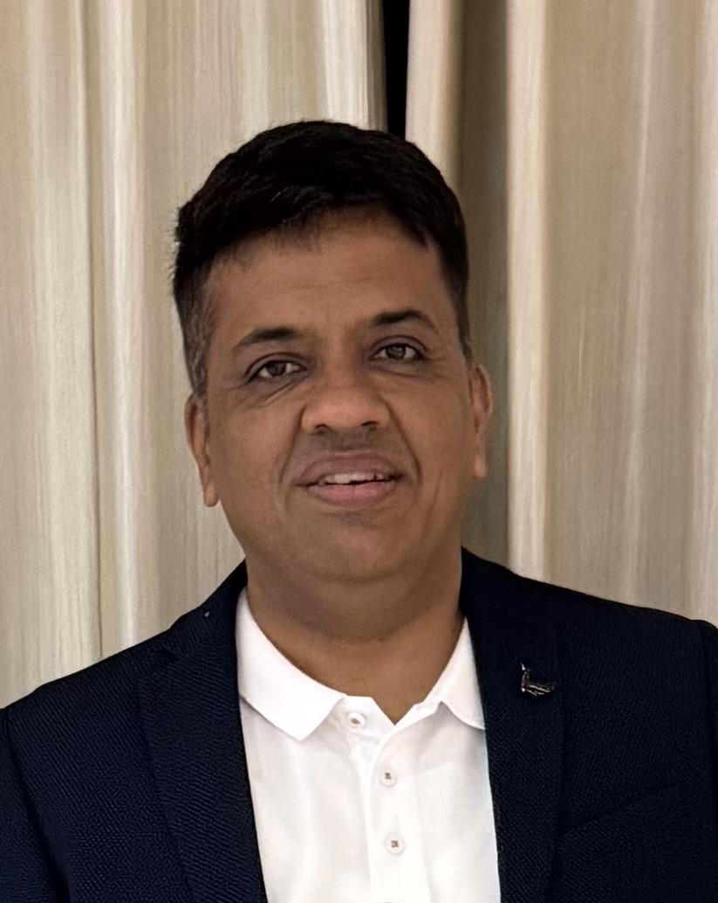

# Rajesh Kriplani

**Chapter Lead | Director | Principal Cloud Architect**  
📍 Bangalore, India · 📞 +91-9972061878 · 📧 rkriplani76@rediffmail.com  
[linkedin.com/in/rajesh-kriplani](http://www.linkedin.com/in/rajesh-kriplani)

---

## Impact Metrics
- **24+** Years Leadership  
- **70+** Engineers Managed  
- **160+** Apps Supported  
- **40%** Faster Cloud Delivery

---

## Profile Summary
Accomplished IT Professional with 24+ years of experience leading enterprise IT projects and teams. Skilled in deploying IT infrastructure, cloud solutions, and managing global operations. Expertise spans IT services, architecture, people management, stakeholder engagement, open-source adoption, negotiation, and achieving results. Led cloud migration initiatives, developed performance testing and configuration management tools, drove container strategy, and completed data centre migration for the Core Technology Group in 18 months. Managed a team supporting 160+ top-tier applications and implemented an enterprise content management system.

I have held positions such as Systems Engineer, Tech Lead, Manager, Principal Cloud Architect, and Chapter Lead, and have extensive experience in platform automation, cloud integration, and cloud migrations. As a Chapter Lead at Commonwealth Bank of Australia, I lead a team of over 70 and oversee the Cloud Integration crew, which includes Vault, Certificate Management, Public Container as a Service, Temporal, and Cloud Control Platforms. I provide technical leadership to ensure these platforms are scalable, reliable, and secure.

---

## Key Leadership Skills
- Cloud Platform Strategy & Innovation  
- Enterprise Architecture (AWS & Azure)  
- Digital Transformation & Cloud Migration Programs  
- Budgeting & Cost Optimization  
- Infrastructure as Code (Terraform & CloudFormation)  
- High-Performance Team Leadership & Coaching  
- Vendor and Product Management  
- Governance, Security, and Compliance  
- Agile & DevSecOps Organizational Enablement

---

## Professional Experience

### Chapter Lead — Cloud Integration  
**Commonwealth Bank Australia** · 03/2025 – Current
- Leading platform engineering across 6 squads.  
- Key contributor to DevSecOps transformation.  
- Delivered EventHub self-service capability in 4 months.  
- Established India-wide cloud integration team.

### Director — Cloud Platform Services  
**Fidelity** · 04/2021 – 03/2025
- Defined and executed a multi-year cloud transformation roadmap impacting 50+ enterprise systems.  
- Directed platform engineering teams across regions to architect and maintain resilient hybrid cloud infrastructures.  
- Led inner and open-source adoption; ran engineering showcases, AWS Jams & workshops.  
- Championed Kubernetes, serverless architectures and zero trust principles.

### Principal Cloud Architect  
**Fidelity** · 04/2018 – 04/2021
- Led migration of mission-critical workloads from on-prem to AWS, achieving 40% faster service delivery.  
- Designed cloud migration patterns and reusable components.  
- Collaborated with cloud enablement teams to accelerate migrations and improve platform reliability.  
- Mentored cross-functional teams on cloud best practices.

### Architect  
**Fidelity** · 07/2014 – 04/2018
- Reviewed application architectures to align with the organisation Technology Blueprint and Roadmap.  
- Developed Data Centre Migration Strategy and managed technology lifecycles.  
- Designed and executed Application Performance Monitoring for critical applications.  
- Participated in migrations to Pivotal Cloud Foundry.

### Project Lead  
**Fidelity** · 07/2010 – 07/2014
- Managed multiple middleware projects with complex architectures (Apache, WebSphere, MQ, Autonomy, Documentum, IIS, Tomcat, SiteMinder).  
- Led a team of 6 to provide end-to-end middleware support for 500+ applications.

### Senior Systems Engineer  
**Fidelity** · 09/2006 – 07/2010
- Built infrastructure for EDMS and performed performance testing and tuning.  
- Managed web hosting support for internal and external customers.

### Systems Engineer  
**Hewlett Packard** · 08/2005 – 08/2006
- Managed complex web hosting and middleware services for internal and external customers.

### Technical Assistant Engineer — CMC (Resident Engineer at ISRO)  
06/1999 – 06/2005
- Maintained and managed IRIX, Octane and VAX/VMS infrastructure at ISRO as a resident engineer.

### Apprentice  
04/1998 – 03/1999
- Designed and implemented network infrastructure across ISRO.

---

## Core Competencies
- Cloud: AWS IaaS, Pivotal Cloud Foundry, Red Hat OpenShift, Kubernetes, Apigee, EKS, Rancher, Docker, Azure  
- DevOps: Jenkins, GitHub, JFrog Artifactory, GitHub Actions, Chef, Shell, Python  
- Storage & Backup: Veritas NetBackup, SoftNAS, NetApp Cloud ONTAP, AWS Storage Gateway, EFS  
- Networking: F5, AVI load balancer  
- Observability: Dynatrace, Splunk, CloudWatch, CloudTrail, Datadog, Observe, Prometheus  
- OS & DB: RHEL, Solaris, AIX, Windows, Oracle, SQL Server  
- Middleware: Apache, Tomcat, Nginx, MQ, WebSphere  
- Security: SiteMinder, PingAccess, PingFederate, OpenID, Venafi

---

## Notable Innovation Projects

### EventHub Platform Delivery
- Provided technical leadership for event streaming platform delivery.  
- Automated onboarding to provide self-service capability.  
- Integrated EventHub with Observe, ServiceNow and Venafi.

### API Compliance Tool
- Developed an OpenAPI-based scoring algorithm and codified standards as validation rules.  
- Categorized standards and adjusted scores by criticality.

### Performance Testing as a Service (PTaaS)
- Designed on-demand performance testing using JMeter.  
- Deployed JMeter cluster on Kubernetes to provide self-service performance testing.

---

## Education
**Post HSC Diploma in Computer Engineering**  
Vallabh Vidyanagar, Anand, Gujarat, India